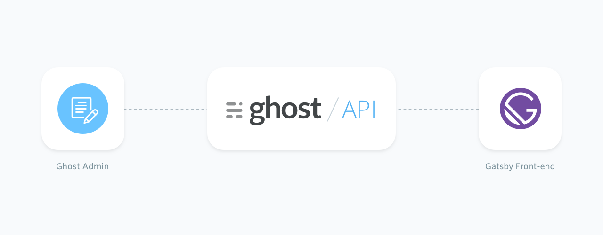
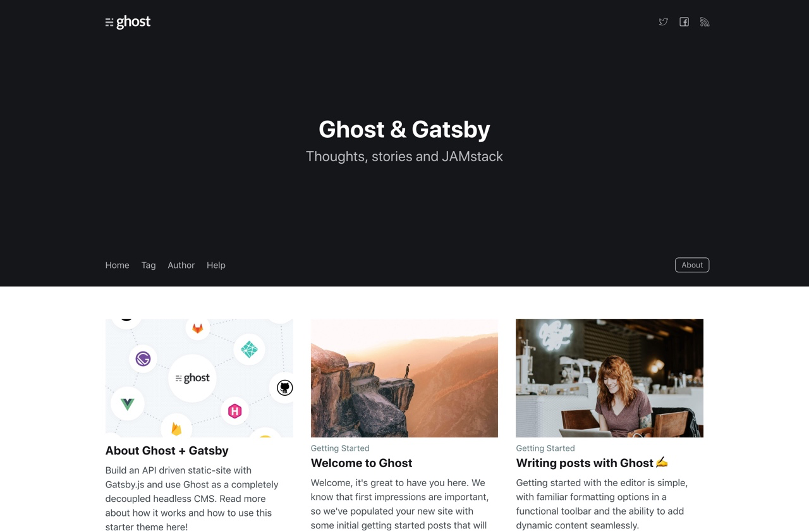

**Build a completely custom front-end to your Ghost site with the power of Gatsby!**

Thanks to the Content API, Ghost can now operate as a [completely decoupled headless CMS](https://blog.ghost.org/jamstack/), allowing developers to build their own front-end with modern web technologies, such as [Gatsby.js](https://www.gatsbyjs.org/). This entire docs site is built in the same manner, so you’re looking at proof that it really works!



The following sections cover how Gatsby can source content from a Ghost site, how to create a Gatsby site using our starter template, and some of the setup required to get you off to the races.

## Sourcing your content

**As with all content sources for Gatsby, content is fed in by [GraphQL](https://www.gatsbyjs.org/tutorial/part-four/), and it’s no different with Ghost. The official [Gatsby Source Ghost](https://github.com/TryGhost/gatsby-source-ghost) plugin allows you to pull content from your existing Ghost site.**

Installing the plugin is the same as any other Gatsby plugin. Use your CLI tool of choice to navigate to your Gatsby project and a package manager to install it:

``` bash
# yarn users
yarn add gatsby-source-ghost
# npm users
npm install --save gatsby-source-ghost
```

After that, the next step is to get API URL and Content API Key of the Ghost site.

The API URL is the site URL ending in `.ghost.io`, for example: `mysite.ghost.io`. For Ghost(Pro) customers, your Ghost site URL also ends in `.ghost.io`. For self-hosted versions of Ghost, use the admin panel access URL - ensure that the self-hosted version is served over a https connection. The Content API Key can be found on the Integrations screen of the Ghost Admin.

Open the `gatsby-config.js` file and add the following to the `plugins` section:

``` json
{
  resolve: `gatsby-source-ghost`,
  options: {
    apiUrl: `https://<your-site-subdomain>.ghost.io`,
    contentApiKey: `<your content api key>`
  }
}
```

Restart the local server to apply these configuration changes.

To learn more about the plugin, check out the [documentation within the repo on GitHub](https://github.com/TryGhost/gatsby-source-ghost#how-to-query). To delve deeper into writing GraphQL queries for Ghost, read our [documentation on the Content API](https://docs.ghost.org/api/content/) and find out more on the [official GraphQL docs](https://graphql.org/learn/queries/).

**Finding this all a little overwhelming? Don’t worry! You’re not alone. Thankfully, Ghost have contributed to the ever growing list of Gatsby Starters with a [Gatsby Starter Ghost](https://github.com/TryGhost/gatsby-starter-ghost) template That has pretty much everything to get you started, including the source plugin mentioned above.**

## Gatsby Starter Ghost

**One of the best ways to start a new Gatsby site is with a Gatsby Starter, and in this case, it’s no different.**

Before starting, download the Gatsby CLI tool with the following CLI command:

``` bash
install -g gatsby-cli
```

Next, pull down the official [Gatsby Starter Ghost](https://github.com/TryGhost/gatsby-starter-ghost) template directly from GitHub:

``` bash
gatsby new my-gatsby-site https://github.com/TryGhost/gatsby-starter-ghost.git
```

Navigate into the newly created project and use either `npm install` or `yarn` to install the dependencies. At Ghost, we prefer to use [Yarn](https://yarnpkg.com/en/docs/install#mac-stable).

Before customising and developing in this new Gatsby site, it’s wise to give it a test run to ensure everything is installed correctly. Because you installed the Gatsby CLI tool as part of the previous steps, you can now run `gatsby develop` in the project folder, which starts up the project and run it on your local machine.

Once everything is installed correctly, navigate to http://localhost:8000 in a browser and view the newly created Gatsby site.



## Making it your own

**So, you’ve set up a Gatsby site, but it’s not showing the right content.** This is where content sourcing comes into play. You may have seen in a previous section about our [Gatsby Source Ghost](https://github.com/TryGhost/gatsby-source-ghost) plugin, which can pull content into the Gatsby site from the Ghost Admin via the Content API.

The Gatsby Start Ghost template already has this built in; all it requires is some configuration. Within the project, navigate to the file `.ghost.json` at root level:

``` json
{
  "development": {
    "apiUrl": "https://gatsby.ghost.io",
    "contentApiKey": "9cc5c67c358edfdd81455149d0"
  },
  "production": {
    "apiUrl": "https://gatsby.ghost.io",
    "contentApiKey": "9cc5c67c358edfdd81455149d0"
  }
}
```

This file is set up to make environment variables a bit easier to control and edit. Change the `apiUrl` value to the URL of the site. For Ghost(Pro) customers, this is the Ghost URL ending in `.ghost.io`, and for people using the self-hosted version of Ghost, it’s the same URL used to view the admin panel.

In most cases, it’s best to change both the `development` and `production` to the same site details. However, when working with a development site, put those details into the `development` json object - it’s very useful when working with clients that are testing new content. Use the `production` details when deploying the site. After saving these changes, restart the local server.

**Using [Netlify](https://www.netlify.com/) to host your site? If so, the `netlify.toml` file that comes with the starter template provides the deployment configuration straight out of the box.**

## Next steps

Take a look at the [tutorials on the official Gatsby site](https://www.gatsbyjs.org/tutorial/) to help with developing in Gatsby.

Want to deploy the site to Netlify? Read our [documentation on Integrating with Netlify](https://docs.ghost.org/integrations/netlify/) and using Web Hooks with Ghost.

For community led support about linking and building a Ghost site with Gatsby, visit [the forum](https://forum.ghost.org/c/themes/).
