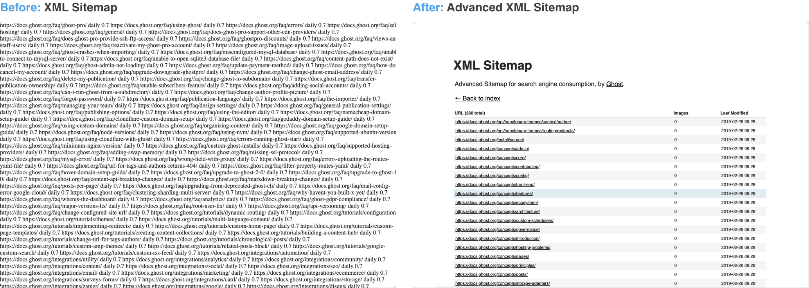

**There are many additional aspects to switching from a typical Ghost front-end to a standalone API driven front-end like Gatsby. The following sections explain some slightly ‘grey area’ topics that have been commonly asked or may be of use when making this transition.**

## Switching over

Switching to a new front-end means handling the old front-end in a different way. 

One option is to make the old pages canonical, meaning that these pages will remain online, but will reference the new counterparts on the API driven site. Check out the documentation on [using canonical URLs in Ghost](https://docs.ghost.org/faq/publishing-options/#add-custom-canonical-urls).

Another way is to turn off the old site entirely and begin directing people to the new site. Ghosts’ front-end can be hidden using the ‘Private Mode’ found in the Ghost Admin under General Settings.

## Generating a sitemap

Providing a well made sitemap for search indexing bots is one of the most important aspects of good SEO. However, creating and maintaining a series of complex ‘for loops’ can be a costly exercise.

The Ghost team have provided an open source plugin for Gatsby to construct an ideal format for generated sitemap XML pages, called [Gatsby Advanced Sitemap plugin](https://github.com/TryGhost/gatsby-plugin-advanced-sitemap). By default, the plugin will generate a single sitemap, but it can be [configured with GraphQL](https://github.com/TryGhost/gatsby-plugin-advanced-sitemap#options) to hook into various data points. Further information can be found in the [sitemap plugin documentation](https://github.com/TryGhost/gatsby-plugin-advanced-sitemap#gatsby-plugin-advanced-sitemap).

The plugin doesn’t just work with Ghost - it’s compatible with an assortment of APIs and content sources. To learn more about using GraphQL and the Ghost API for plugins, such as the Gatsby sitemap plugin, check out our GraphQL Recipes for Ghost.

## Using Gatsby plugins with Ghost content

With the ever expanding list of plugins available for Gatsby, it’s hard to understand which plugins are needed to make a high quality and well functioning site running on the Ghost API.

[Gatsby Source Filesystem](https://www.gatsbyjs.org/packages/gatsby-source-filesystem/) is a plugin for creating additional directories inside a Gatsby site. This is ideal for storing static files (e.g. error pages), site-wide images, such as logos, and site configuration files like robots.txt.

[Gatsby React Helmet plugin](https://www.gatsbyjs.org/packages/gatsby-plugin-react-helmet/) is very useful for constructing metadata in the head of any rendered page. The plugin requires minimum configuration, but can be modified to suit the need.

## Further reading

There is plenty of reference material and resources on the [official Gatsby site](https://www.gatsbyjs.org/tutorial/), along with a long list of [available plugins](https://www.gatsbyjs.org/plugins/). It may also be worth understanding the underlying concepts of [static sites](https://jamstack.org/) and how they work differently to other sites.

To get an even more boarder view of performant site development check out web.dev from Google, which explores many topics on creating site for the modern web.
